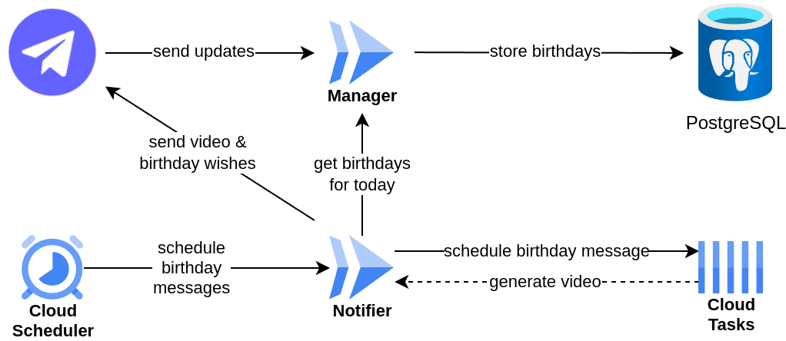

# An Unhinged Weeb Birthday Bot

[![MIT License][license-shield]][license-url]
[![Telegram Demo][telegram-bot-shield]][telegram-bot-url]
![workflow-status-shield]

<p align="center">
  <video src="https://github.com/4Kaze/birthdaybot/assets/47448124/bd79f989-f8b3-4f17-a49b-2cac932b2d8e"/>
</p>

## About the bot
This bot allows users to register their birthdays in a group chat and receive a personalized video message on their special day.

In case you wonder, the video is from the anime [Mayo Chiki!](https://myanimelist.net/anime/10110/Mayo_Chiki) (jp. まよチキ!).

## Getting Started

This bot was designed to run in Google Cloud, specifically Cloud Run - a Container as a Service (CaaS) solution, but can be modified to run on other serverless environments.

Follow these steps to deploy your own version.

### Prerequisites
Tools you'll need:
* Go 1.22.2 (see [instructions](https://go.dev/doc/install))
* Terraform  (see [instructions](https://developer.hashicorp.com/terraform/install))
* Podman (see [instructions](https://developer.hashicorp.com/terraform/install))
* gcloud CLI (see [instruction](https://cloud.google.com/sdk/docs/install))

Also, if you wish to run video generation locally:
* FFmpeg - installed with the package manager of your choice

You'll also need a PostgreSQL database. I recommend the free [supabase](https://supabase.com/).

### Enable Required APIs for your Google Cloud Project
This project makes use of the following Google Cloud services:
* Artifact Registry - for storing container images
* Cloud Scheduler - to trigger scheduling birthday notifications
* Cloud Tasks - to schedule birthday notifications
* Cloud Run - to run the bot's logic

Set the default project ID if you haven't already:
```sh
gcloud config set project PROJECT_ID
```

Enable the required APIs for the project:
```sh
make enable_apis
```

### Build container images
Copy the `.env.example` file and fill out the values.

Create a repository to store container images:
```sh
make create_repository
```
Then configure the credential helper for the Artifact Registry:
```sh
make configure_repository_auth
```
Build and push the container images for both manager and notifier components. To learn more about the components, read the [Architecture](#Architecture) section.
```sh
make update_manager version=1.0
make update_notifier version=1.0
```

### Setup the database
Since the project uses an SQL database to store birthday data, you need to create appropriate tables and indexes. Run the `tables.sql` file, e.g. using the `psql` cli client.

### Create Google Cloud services
The project uses Terraform to store all Google Cloud service configurations. You may want to create a `terraform.tfvars` file in the `terraform` directory to avoid inputting them each time you run Terraform. Use `terraform.tfvars.example` as a template.

To create and configure all services, run the following in the `terraform` directory:
```sh
terraform init
terraform apply
```

And that's it! You've got yourself a working bot! ( ᵔ ᗜ ᵔ )/

## Running locally
It's possible to generate a birthday video locally. You'll need Go 1.22.2 and FFmpeg in your $PATH. To generate a video, use the following command:
```sh
go run local/main.go notifier/resources path-to-your-image
```
The path to the generated video will be printed in the output.

## Architecture

The bot consists of two components: 
* Manager - a service that handles Telegram updates, stores, and retrieves birthdays.
* Notifier - a job that runs once a day to generate videos and send them to group chats. 

While the manager service doesn't need much power, the notifier job runs on 1 GiB of RAM to accommodate the resource-intensive video generation process. However, since it is active only once a day, it can scale down to zero instances when not in use, thereby limiting resource usage and reducing costs.

As previously mentioned, the bot leverages Cloud Scheduler and Cloud Tasks to asynchronously generate birthday videos. Given that this process takes more than 30 seconds, it was essential to mitigate the risk of timeouts. This architecture effectively addresses this challenge.

Every day at 7 AM UTC, Cloud Scheduler triggers the notifier job, which retrieves the day's birthdays from the manager service. It then schedules a video generation task for each birthday with a small delay. Cloud Tasks manages deduplication and retries in case of any issues. It invokes the notifier service one birthday at a time, requesting video generation, which is then sent to the appropriate group chat with a birthday message.

Below you'll find a diagram showing the flow between the bot's components.

<p align="center">
  <picture>
    <source media="(prefers-color-scheme: dark)" srcset="diagram-dark.png">
    <source media="(prefers-color-scheme: light)" srcset="diagram-light.png">
    
  </picture>
</p>

## Contributing

I'm open to contributions. Feel free to fork the project to use it for your own purposes or to create a PR with new features/fixes.

## License

Distributed under the MIT License. See `LICENSE` for more information.

## Contact

[![Chat on Telegram][telegram-shield]][telegram-profile-url]


[license-shield]: https://img.shields.io/github/license/4Kaze/birthdaybot
[license-url]: https://github.com/4Kaze/birthdaybot/blob/main/LICENSE
[telegram-bot-url]: https://t.me/otanjoubi_bot
[telegram-bot-shield]: https://img.shields.io/badge/Demo-@otanjoubi_bot-green?logo=telegram
[workflow-status-shield]: https://img.shields.io/github/actions/workflow/status/4Kaze/birthdaybot/ci.yml
[telegram-shield]: https://img.shields.io/badge/-Contact%20me%20on%20Telegram-gray?logo=telegram
[telegram-profile-url]: https://t.me/yonkaze
